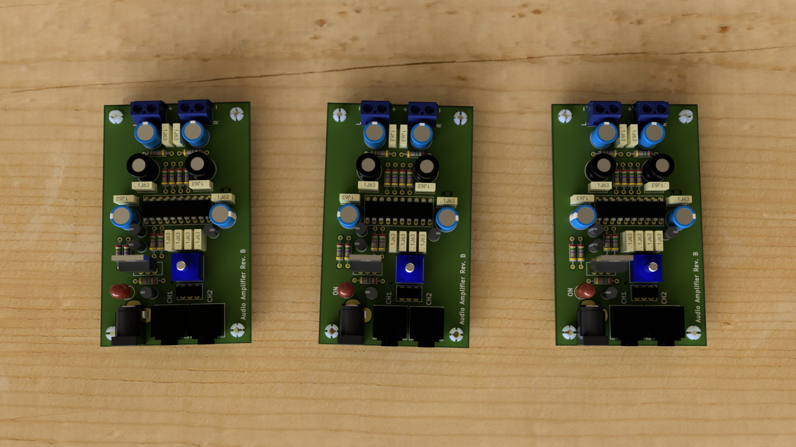
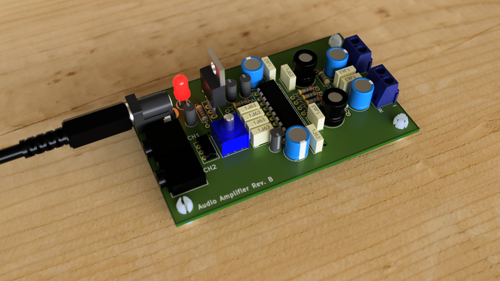

# Audio Amplifier

## Introduction
This is a Class D audio amplifier built around a TPA3122D2N amplifier from Texus Instrument. It features two stereo audio jacks that allows two sources to be connected to the amplifier at the same time (for example a music player and a laptop).

A slide switch allows selection of switch input source to feed into the amplfier. The onboard potentiometer provides volume control. Power is provided using a 16V DC 2A adapter. This audio amplifier was designed as part of a custom audio-visual setup.

The amplifier accepts an input voltage between 15V to 25V. The output power is 10W per channel. It can drive speakers with impedances between 4 and 8 Ohms.

## Gallery

