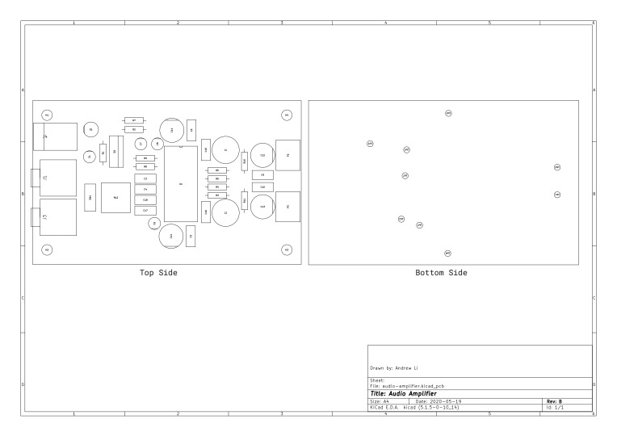

# Assembly Drawing

| Reference                             	|  Quantity 	| Value 	|  Manufacturer           	| MPN            	|  Part Description               	|
|---------------------------------------	|-----------	|-------	|-------------------------	|----------------	|---------------------------------	|
| C12 C13 C11 C14                       	| 4         	| 470uF 	| ~                       	| ~              	| Generic 470uF capacitor         	|
| C3 C4 C2 C5 C9 C10 C15 C16 C17   C18  	| 10        	| 1uF   	| ~                       	| ~              	| Generic Through Hole Capacitor  	|
| C6 C1 C7 C8                           	| 4         	| 10uF  	| ~                       	| ~              	| Generic 10uF capacitor          	|
| D1                                    	| 1         	| ~     	| ~                       	| ~              	| Generic Through Hole LED        	|
| J1 J3                                 	| 2         	| ~     	| ~                       	| ~              	| Audio Jack                      	|
| J4                                    	| 1         	| ~     	| RS                      	| 448-376        	| Power socket, 2.5mm             	|
| L1 L2                                 	| 2         	| 47uH  	| ~                       	| ~              	| Generic 47uH inductor           	|
| P2 P3                                 	| 2         	| ~     	| ~                       	| ~              	| Generic screw socket connector  	|
| Q1                                    	| 1         	| ~     	| International Rectifier 	| AUIRF9Z34N     	| MOSFET, P-Channel, 19A, 0R1     	|
| R10 R11 R4 R6 R3 R5 R9 R8 R1   R2 R7  	| 11        	| 4K7   	| ~                       	| ~              	| Generic Through Hole Resistor   	|
| R12                                   	| 1         	| 10k   	| Bourns                  	| 3310H-025-103L 	| POT 10K OHM 1/4W PLASTIC LINEAR 	|
| SW1                                   	| 1         	|       	| C&K                     	| JS202011CQN    	| SWITCH SLIDE DPDT 300MA 6V      	|
| U1                                    	| 1         	| ~     	| Texas Instruments       	| TPA3122D2N     	| TPA3122D2N, PDIP                	|
